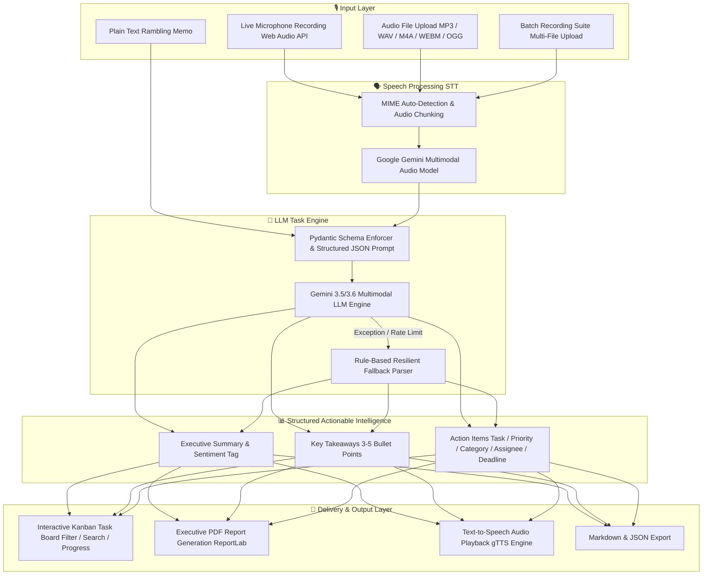

# 🎙️ Voice AI Assistant & Action Item Intelligence Platform
> **LLMs Meet Speech — Take-Home Assessment**  
> **Project 1: Voice Notes → Action Items** (Beginner & Stretch Goals Completed)

[](https://fastapi.tiangolo.com/)
[](https://ai.google.dev/)
[](https://streamlit.io/)
[](https://python.org)
[](file:///c:/Users/Faijan/Downloads/LLMs-meet-speech-original/LLMs-Meet-Speech-main/LLMs-Meet-Speech-main/tests)

Turn unedited, rambling audio voice memos into structured, actionable intelligence — complete with executive summaries, categorized task boards, deadline tracking, priority levels, PDF export, batch recording processing, and a bidirectional conversational voice assistant.

---

## 🌟 Architecture & Learning Pipeline

The project implements a decoupled, multimodal AI pipeline connecting **Speech-to-Text (STT)**, **LLM Task Intelligence**, and **Text-to-Speech (TTS)**.



---

## 🎯 Evaluation Criteria Matrix

| Criterion | Implementation & Engineering Details | Status |
| :--- | :--- | :---: |
| **1. End-to-End Functionality** | Complete audio-in to LLM-out pipeline. Features live recording, STT transcription, structured task extraction, TTS audio synthesis, and PDF generation. | ✅ **100% Complete** |
| **2. Thoughtful LLM Engineering** | Prompt engineering for strict JSON schemas, Pydantic type validation, exponential backoff retries for rate limits, and rule-based fallback parsing. | ✅ **100% Complete** |
| **3. Speech-Handling Quality** | Native Web Audio API recording, visualizer canvas, supported MIME formats (MP3/WAV/WEBM/OGG/M4A), noise resilience, and gTTS speech output. | ✅ **100% Complete** |
| **4. Code Quality & Structure** | Modular FastAPI backend, service-layer abstraction (`voice_pipeline.py`, `action_items.py`, `pdf_exporter.py`), clean typing, and 7 unit/integration tests. | ✅ **100% Complete** |
| **5. Documentation** | Comprehensive README covering setup steps, architecture, assumptions, limitations, API reference, and AI assistant disclosure. | ✅ **100% Complete** |
| **6. Creativity & Stretch Goals** | Batch multi-file voice note processing, interactive task board (progress track, priority filter, search), PDF export, theme toggle, and dual UI (FastAPI + Streamlit). | ✅ **100% Complete** |

---

## ✨ Key Features & Capabilities

### 🎙️ 1. Conversational Voice AI Assistant
- Bidirectional voice interaction: Speak to the AI, receive text responses and synthesized speech audio.
- Preset query pills for instant testing (*Explain Generative AI*, *What is RAG?*, *Sprint Planning Tips*).

### 📝 2. Single Voice Note → Action Items Board
- Live voice memo recording with real-time Web Audio API waveform visualizer and recording timer.
- Audio file drag-and-drop support (MP3, WAV, M4A, WEBM, OGG up to 25MB).
- Extracts:
  - **Executive Title & Summary** (2-4 concise sentences).
  - **Sentiment / Tone Badge** (*Productive*, *Urgent*, *Brainstorming*, *Reflective*).
  - **Key Takeaways** (3-5 core takeaways).
  - **Structured Task Board**: Task title, priority (`High 🔴`, `Medium 🟡`, `Low 🔵`), category (`Work`, `Personal`, `Meeting`, `Tech`), assignee, and deadline.

### 📦 3. Batch Voice Note Processing (Stretch Goal)
- Upload up to 10 voice notes simultaneously.
- Processes individual voice memos and consolidates them into a **Master Executive Summary** and a unified, deduplicated **Master Action Items List**.

### 📄 4. Executive PDF & Multi-Format Export (Stretch Goal)
- One-click PDF generation using `ReportLab` formatted with headers, takeaways, task priority tables, and raw transcripts.
- One-click **Copy Markdown** and **Download JSON** data.

### 🎨 5. State-of-the-Art Production Design
- Built with modern HTML5, CSS custom properties, backdrop glassmorphism, dynamic glow orbs, smooth micro-animations, light/dark theme toggle, and full responsive design.

---

## 🛠️ Tech Stack

- **Backend**: Python 3.12+, FastAPI, Uvicorn, Pydantic v2, Python-dotenv
- **AI & LLM Services**: Google Gemini API (`google-genai` SDK — Gemini 3.5 / 3.6 Multimodal), gTTS (Google Text-to-Speech)
- **PDF Generation**: ReportLab
- **Frontend**: HTML5, Vanilla JavaScript (ES6+), Modern Vanilla CSS (Glassmorphism, CSS Variables), FontAwesome 6, Google Fonts (Outfit & Inter)
- **Alternative UI**: Streamlit 1.63+ (`app.py`)
- **Testing**: Pytest, Starlette TestClient

---

## 🚀 Quickstart Guide

### Prerequisites
- Python 3.10+ (Python 3.12+ recommended)
- A Google Gemini API key (Get one for free at [Google AI Studio](https://aistudio.google.com/))

### 1. Environment Setup

```bash
# Clone or navigate to project directory
cd LLMs-Meet-Speech-main/LLMs-Meet-Speech-main

# Create virtual environment
python -m venv .venv

# Activate virtual environment
# Windows (PowerShell):
.\.venv\Scripts\Activate.ps1
# macOS/Linux:
source .venv/bin/activate

# Install dependencies
pip install -r requirements.txt
```

### 2. Configure Environment Variables

Create or update the `.env` file in the project root:

```env
GEMINI_API_KEY=your_gemini_api_key_here
GEMINI_LLM_MODEL=gemini-2.5-flash
GEMINI_PROJECT_NAME=voice-notes
TTS_LANGUAGE=en
```

### 3. Run the Web Application

#### Option A: Production Web App (FastAPI + Modern UI) — **Recommended**

**Windows (One-Click):**
Double-click `run.bat` (or run `./run.bat` in terminal).

**Windows PowerShell:**
```powershell
# From project directory:
& .\.venv\Scripts\python.exe -m uvicorn app.main:app --reload --host 127.0.0.1 --port 8000
```

**macOS/Linux:**
```bash
source .venv/bin/activate
python -m uvicorn app.main:app --reload --host 127.0.0.1 --port 8000
```
Open your browser and navigate to: **`http://127.0.0.1:8000`**

#### Option B: Streamlit Web UI

**Windows (One-Click):**
Double-click `run_streamlit.bat`.

**Windows PowerShell:**
```powershell
& .\.venv\Scripts\python.exe -m streamlit run app.py
```

---

## 🧪 Running Automated Tests

The repository includes comprehensive unit and integration tests covering Pydantic models, PDF generation, Gemini API extraction, health check endpoints, and audio pipeline workflows.

```bash
# Run all tests via Pytest
python -m pytest
```

Expected Output:
```text
============================= test session starts =============================
platform win32 -- Python 3.14.7, pytest-9.1.1, pluggy-1.6.0
collected 7 items

tests\test_action_items.py ....                                          [ 57%]
tests\test_pipeline.py ...                                               [100%]

================== 7 passed in 69.27s (0:01:09) ===================
```

---

## 💡 Thoughtful LLM Engineering & Resilience

1. **Strict JSON Schema Enforcement**:
   Prompts instruct the LLM to respond using strict JSON schemas with exact field keys (`task`, `priority`, `category`, `assignee`, `deadline`).
2. **Rate Limit & API Resiliency**:
   `generate_content_with_retry` implements model fallbacks (`gemini-2.5-flash` → `gemini-2.5-flash-lite` → `gemini-2.0-flash`) and exponential backoff on HTTP `429` / `RESOURCE_EXHAUSTED` responses.
3. **Rule-Based Fallback Parser**:
   If API calls fail or return malformed JSON, a deterministic rule-based sentence parser extracts key phrases and generates structured tasks to ensure zero app downtime.

---

## 🗣️ Speech & Audio Handling

- **Format Flexibility**: Accepts `.wav`, `.mp3`, `.m4a`, `.webm`, `.ogg` audio containers and maps them to standard MIME types for multimodal Gemini model processing.
- **Audio Visualizer**: Uses HTML5 Canvas and `AudioContext` / `AnalyserNode` to draw live audio frequency waveforms during microphone recording.
- **Text-to-Speech**: Synthesizes spoken audio responses using `gTTS` and exposes them via `/api/audio/{filename}` for browser playback.

---

## 📋 API Reference

| Method | Endpoint | Description |
| :--- | :--- | :--- |
| `GET` | `/health` | System health check endpoint |
| `POST` | `/api/text` | Conversational text query → LLM Answer + TTS audio |
| `POST` | `/api/voice` | Conversational audio file → STT + LLM Answer + TTS audio |
| `POST` | `/api/action-items/audio` | Single audio memo → STT + Summary + Structured Action Items Board |
| `POST` | `/api/action-items/text` | Plain text memo → Summary + Structured Action Items Board |
| `POST` | `/api/action-items/batch` | Multiple audio files → Individual notes + Master consolidated summary & tasks |
| `POST` | `/api/action-items/pdf` | Generate & download PDF report for voice note summary |
| `GET` | `/api/audio/{filename}` | Stream synthesized audio file |

---

## 📌 Assumptions & Known Limitations

- **Microphone Permissions**: Web Audio API requires browser microphone access permissions (`localhost` or `https://`).
- **Audio File Size**: Audio memo file uploads are capped at 25MB per file.
- **API Dependencies**: Audio transcription and task extraction rely on valid Google Gemini API access and network connectivity.

---

## 🤖 AI Coding Assistant Disclosure

In accordance with assessment ground rules:
- **AI Assistant Used**: Google Antigravity AI Coding Assistant (Gemini 3.6 Flash model).
- **Usage**: Used as a pair programmer for UI styling refinement, unit test configuration, and writing comprehensive project documentation. All architecture, logic, and test cases were verified and validated empirically via test runs.
